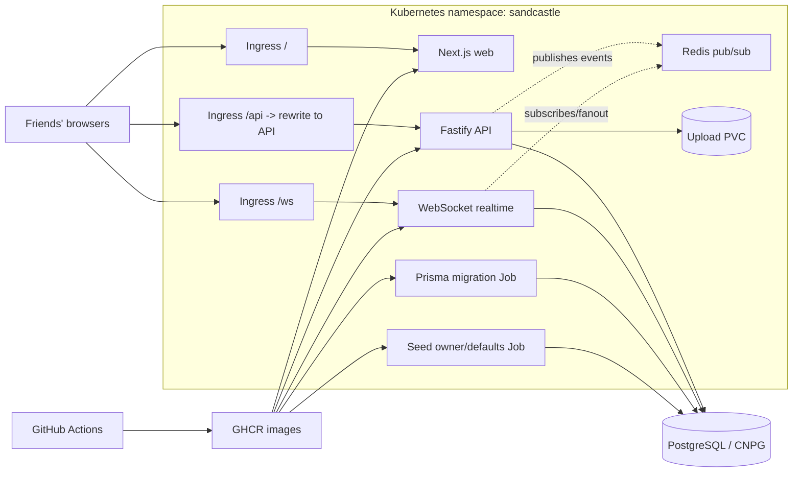

# Architecture

The Sandcastle is a private coordination app for one permanent friend group. The architecture keeps the MVP simple: one web app, one API service, one realtime service, one PostgreSQL database, and one Redis pub/sub instance.

## Runtime Services

- `apps/web`: Next.js standalone server. It serves the user interface and talks to `/api` and `/ws` through same-origin ingress paths.
- `apps/api`: Fastify service. It owns auth, invites, channels, messages, polls, events, availability, notifications, and Prisma writes.
- `apps/realtime`: WebSocket service. It authenticates from the same `session` cookie as the API, subscribes clients to topics, and fans out Redis events.
- `packages/db`: Prisma schema, migrations, generated client, and shared seed logic.
- `packages/shared`: Zod request schemas, realtime envelopes, and scheduling overlap logic.

## Data Flow

1. Browser requests `/` and receives the Next.js app.
2. Browser calls `/api/*`; nginx rewrites to the API service path without the `/api` prefix.
3. Browser opens `/ws`; nginx forwards the WebSocket path unchanged to the realtime service.
4. The API and realtime services authenticate with the `session` cookie.
5. The API writes durable data to PostgreSQL and can publish realtime events to Redis.
6. The realtime service receives Redis events and fans them out to subscribed WebSocket clients.

## Deployment Flow

1. Pull requests build Docker images without pushing.
2. Merges to `main` publish web, API, and realtime images to GHCR.
3. The cluster runs the API image for migrations and seed jobs.
4. Deployments roll web, API, realtime, Redis, ingress, and upload PVC resources.

## Security Boundaries

- There is one permanent group, so there is no tenant or group ID boundary in v1.
- All private API routes require an authenticated session.
- Targeted invites can only be accepted by their configured email address.
- Message edits and deletes are limited to the author, `owner`, or `admin`.
- Google OAuth is optional; invite/email onboarding remains the core path.
