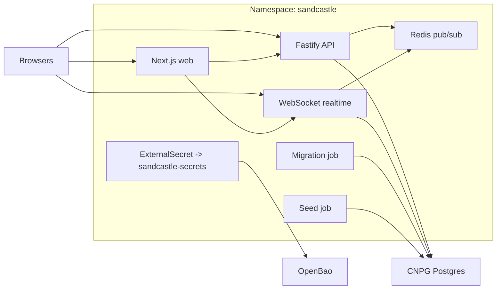

# Architecture

Sandcastle is a single-group coordination app with one web app, one API service, one realtime service, Postgres, and Redis.

## Runtime Responsibilities

- `apps/web`: login, invite acceptance, password reset, channels, events, and availability UI
- `apps/api`: invite auth, session management, role checks, profile updates, channel/event/availability writes
- `apps/realtime`: session-cookie websocket auth plus Redis fanout
- `packages/db`: Prisma schema, migrations, and seed logic
- `packages/shared`: shared request contracts, permissions, and realtime envelope types

## Scope Boundaries

This MVP intentionally excludes polls, thread workflows, uploads, notifications, gaming integrations, and Google OAuth. Those codepaths should not be part of the active release surface.
